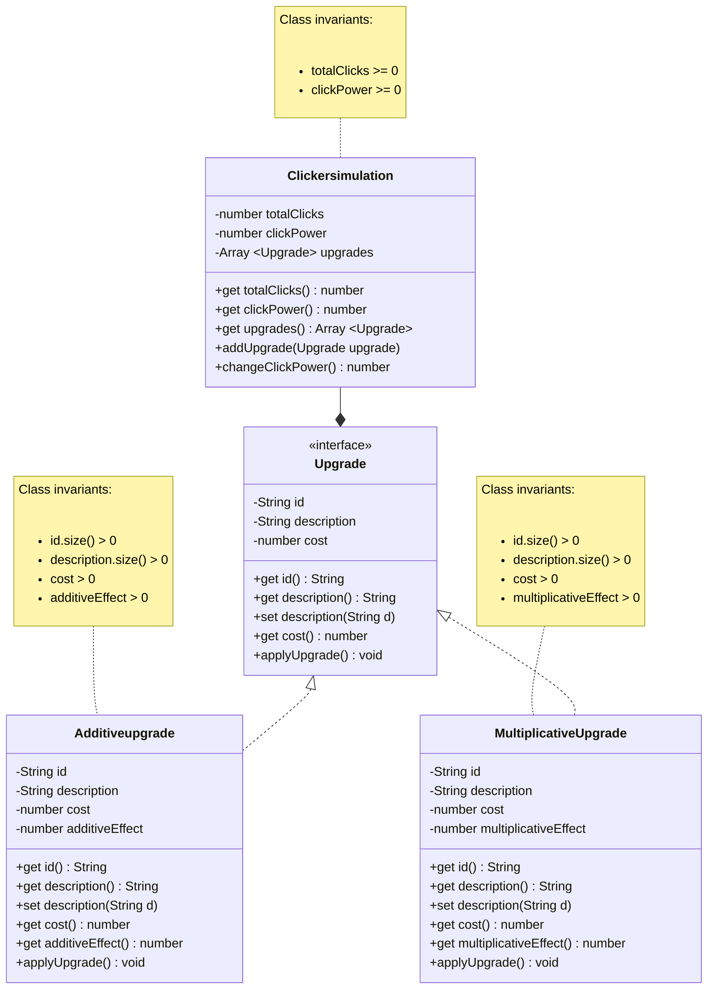

# Domain model

```mermaid
classDiagram
    class Clickersimulation {
        -number totalClicks
        -number clickPower
        -Array ~Upgrade~ upgrades
        
        +get totalClicks() number
        +get clickPower() number
        +get upgrades() Array ~Upgrade~
        +addUpgrade(Upgrade upgrade)
        +changeClickPower() number
    }

    Clickersimulation --* Upgrade
    
    class Upgrade {
        <<interface>>
        -String id
        -String description
        -number cost
        
        +get id() String
        +get description() String
        +set description(String d)
        +get cost() number
        
        +applyUpgrade() void
    }
    
    Upgrade <|.. Additiveupgrade
    Upgrade <|.. MultiplicativeUpgrade
    
    class Additiveupgrade {
        -String id
        -String description
        -number cost
        -number additiveEffect

        +get id() String
        +get description() String
        +set description(String d)
        +get cost() number
        +get additiveEffect() number
        
        +applyUpgrade() void
    }

    class MultiplicativeUpgrade {
        -String id
        -String description
        -number cost
        -number multiplicativeEffect

        +get id() String
        +get description() String
        +set description(String d)
        +get cost() number
        +get multiplicativeEffect() number
        
        +applyUpgrade() void
    }

    note for Clickersimulation "Class invariants:  
    <ul>
        <li> totalClicks >= 0
        <li> clickPower >= 0
    </ul>"
        
    note for Additiveupgrade "Class invariants: 
    <ul>
        <li> id.size() > 0
        <li> description.size() > 0
        <li> cost > 0
        <li> additiveEffect > 0
    </ul>"

    note for MultiplicativeUpgrade "Class invariants: 
    <ul>
        <li> id.size() > 0
        <li> description.size() > 0
        <li> cost > 0
        <li> multiplicativeEffect > 0
    </ul>"
```