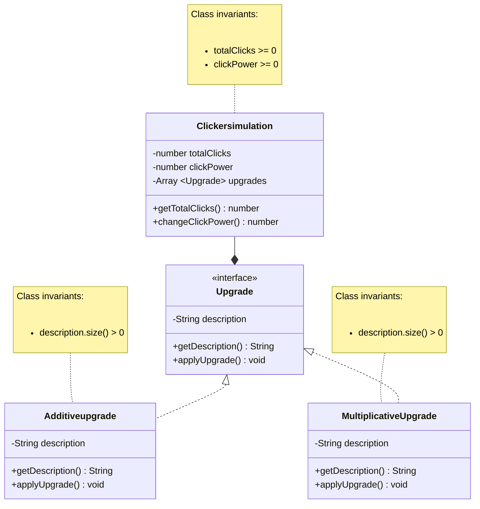

# Domain model

```mermaid
classDiagram
    class Clickersimulation {
        -number totalClicks
        -number clickPower
        -Array ~Upgrade~ upgrades
        
        +getTotalClicks() number
        +changeClickPower() number
    }

    Clickersimulation --* Upgrade
    
    class Upgrade {
        <<interface>>
        -String description
        
        +getDescription() String
        +applyUpgrade() void
    }
    
    Upgrade <|.. Additiveupgrade
    Upgrade <|.. MultiplicativeUpgrade
    
    class Additiveupgrade {
        -String description

        +getDescription() String
        +applyUpgrade() void
    }

    class MultiplicativeUpgrade {
        -String description

        +getDescription() String
        +applyUpgrade() void
    }

    note for Clickersimulation "Class invariants:  
    <ul>
        <li> totalClicks >= 0
        <li> clickPower >= 0
    </ul>"
        
    note for Additiveupgrade "Class invariants: 
    <ul>
        <li> description.size() > 0
    </ul>"

    note for MultiplicativeUpgrade "Class invariants: 
    <ul>
        <li> description.size() > 0
    </ul>"
```