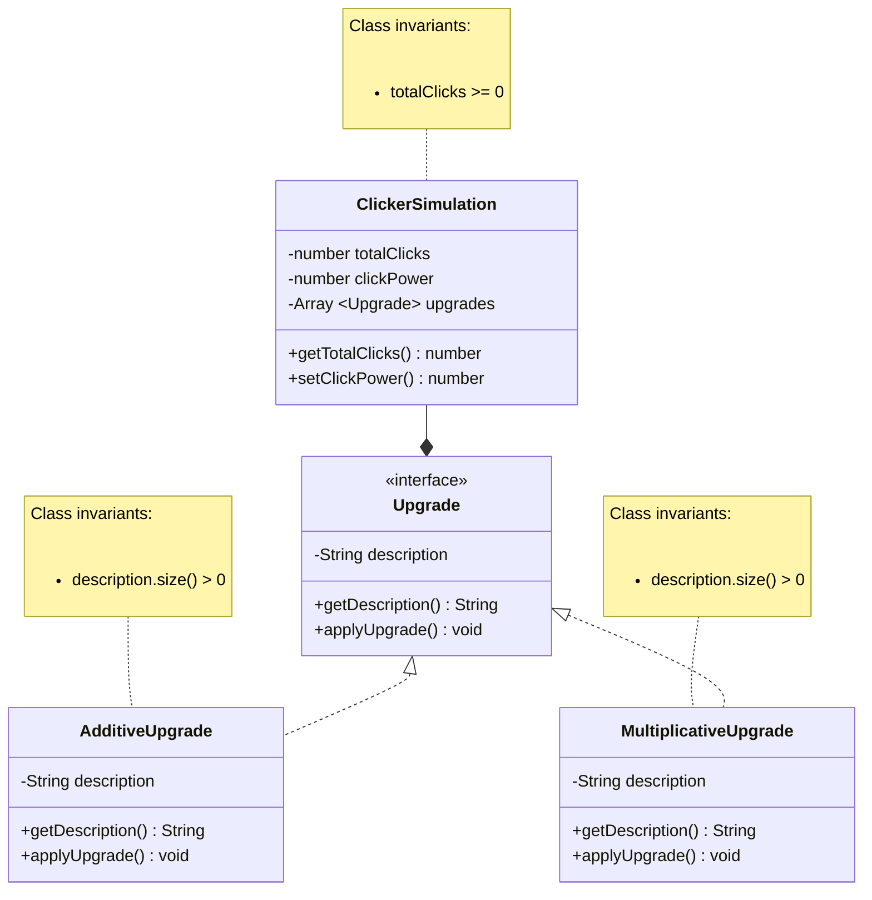

# Domain model

```mermaid
classDiagram
    class ClickerSimulation {
        -number totalClicks
        -number clickPower
        -Array ~Upgrade~ upgrades
        
        +getTotalClicks() number
        +setClickPower() number
    }

    ClickerSimulation --* Upgrade
    
    class Upgrade {
        <<interface>>
        -String description
        
        +getDescription() String
        +applyUpgrade() void
    }
    
    Upgrade <|.. AdditiveUpgrade
    Upgrade <|.. MultiplicativeUpgrade
    
    class AdditiveUpgrade {
        -String description

        +getDescription() String
        +applyUpgrade() void
    }

    class MultiplicativeUpgrade {
        -String description

        +getDescription() String
        +applyUpgrade() void
    }

    note for ClickerSimulation "Class invariants:  
    <ul>
        <li> totalClicks >= 0
    </ul>"
        
    note for AdditiveUpgrade "Class invariants: 
    <ul>
        <li> description.size() > 0
    </ul>"

    note for MultiplicativeUpgrade "Class invariants: 
    <ul>
        <li> description.size() > 0
    </ul>"
```