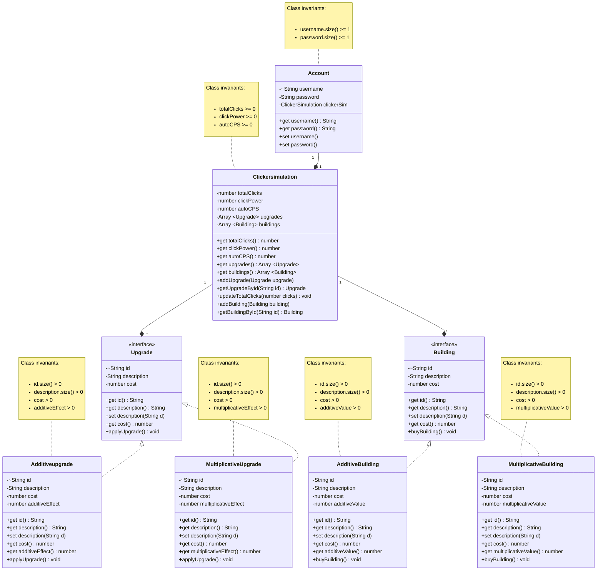

# Domain model

## Conventions:
* Cardinality: symbols (1, +, *) on our relationship lines.
* 1: exactly 0 or 1; +: one or more; *: 0 or more.
* If a value can be null/undef: use ? as type prefix.
* If a value must be unique for all instances of that class use ~ as type prefix.
* Relationships will be bidirectional.

## Changes in Phase 2:
* Added 3 new classes:
  * Account (contains an instance of ClickerSimulation and handles user identification)
  * Building (interface, used for autoclicking)
    * AdditiveBuilding
    * MultiplicativeBuilding

* Made Changes to ClickerSimulation:
  * Added array of Buildings and supporting methods
  * Added new field **autoCPS** that will increase totalClicks automatically
  * Buildings will increase autoCPS by a certain amount with every purchase

* Added data modelling information like cardinality, constraints, and bidirectional relationships.
  * 1 Account is composed of 1 ClickerSimulation
  * 1 ClickerSimulation is composed of many Upgrades

