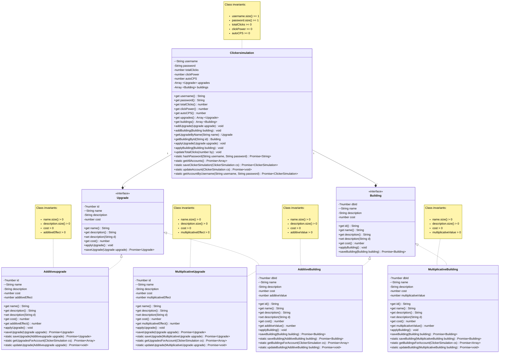

# Domain model

## Conventions:
* Cardinality: symbols (1, +, *) on our relationship lines.
* 1: exactly 0 or 1; +: one or more; *: 0 or more.
* If a value can be null/undef: use ? as type prefix.
* If a value must be unique for all instances of that class use ~ as type prefix.
* Relationships will be bidirectional.

