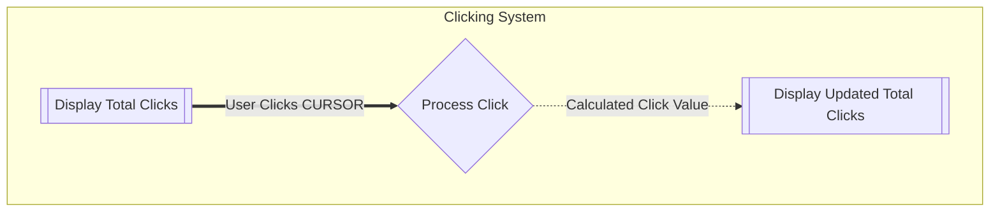
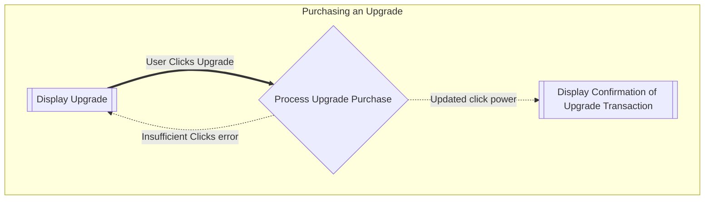

# Flows of Interaction

## Diagrams

### Clicking System
* In this task, the flow of interaction for user clicks on a 'thing' (A CURSOR button in this case) is modelled. Listed below is the desired flow:
  * User clicks on the CURSOR item
  * User is able to see the number of times that the thing has been clicked

### Purchase Upgrade
* In this task, the flow of interaction for purchasing an upgrade is modelled. Listed below is the desired flow:
  * User can view and purchase an upgrade
  * Purchasing an upgrade will increase the power of clicking (e.g., clicking once gives you 10 clicks).
