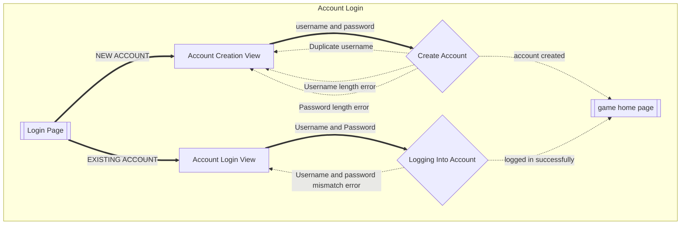
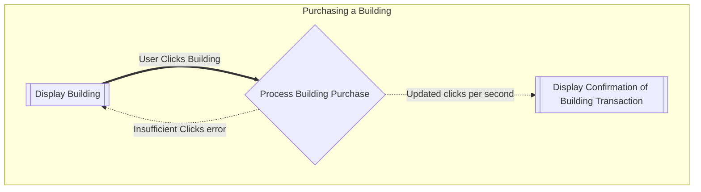
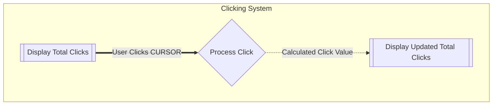
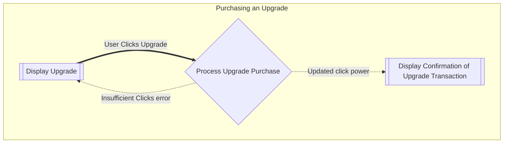

# Flows of Interaction

## Changes in Phase 2:
* Added 2 new flows:
  * Account Login
  * Building purchase

## Diagrams

### Account Login
* In this task, the flow of interaction for creating a new account and signing into the account is modelled. Listed below is the desired flow:
  * User can decide to create a new account or log into an existing account.
  * If creating a new account:
    * User enters a username and password for their new account
    * If there is an error, User must try again until they fulfil all account requirements
    * User successfully creates a new account and is logged in directly
  * If logging into an existing account:
    * User enters a username and password for their account
    * If username or password does not match, User must try again until they match
    * User successfully logs into their account

```mermaid
flowchart
    subgraph Account Login
        
        loginPage[[Login Page]]
        loginPage == NEW ACCOUNT ==> newAccount
        loginPage == EXISTING ACCOUNT ==> existingAccount

        newAccount[Account Creation View]
        newAccount == username and password==> createAccountProcessing
        
        createAccountProcessing{Create Account}
        createAccountProcessing -. Duplicate username .-> newAccount
        createAccountProcessing -. Username length error .-> newAccount
        createAccountProcessing -. Password length error .-> newAccount
        createAccountProcessing -. account created .-> loggedIn

        existingAccount[Account Login View]
        existingAccount == Username and Password ==> loginProcessing
        loginProcessing{Logging Into Account}
        loginProcessing -. Username and password mismatch error .-> existingAccount
        loginProcessing -. logged in successfully .-> loggedIn
        
        loggedIn[[game home page]]
    end
```

### Building purchase
* In this task, the flow of interaction for viewing and purchasing a building is modelled. Listed below is the desired flow:
  * User can view and purchase a building to autoclick for them
  * Purchasing a building will automatically click periodically for the User (e.g., buildings click once per second).

```mermaid
flowchart
  subgraph Purchasing a Building
    displayBuildings[[Display Building]]
    displayBuildings == User Clicks Building ==> hasSufficientClicks

    hasSufficientClicks{Process Building Purchase}
    hasSufficientClicks -. Updated clicks per second .-> displayConfirmation
    hasSufficientClicks -. Insufficient Clicks error.-> displayBuildings

    displayConfirmation[[Display Confirmation of Building Transaction]]

  end
```

### Clicking System
* In this task, the flow of interaction for user clicks on a 'thing' (A CURSOR button in this case) is modelled. Listed below is the desired flow:
  * User clicks on the CURSOR item
  * User is able to see the number of times that the thing has been clicked

```mermaid
flowchart
  subgraph Clicking System
    start[[Display Total Clicks]]
    start == User Clicks CURSOR ==> calculateClick

    calculateClick{Process Click}
    calculateClick -. Calculated Click Value .-> displayUpdatedTotalClicks

    displayUpdatedTotalClicks[[Display Updated Total Clicks]]
  end
```

### Purchase Upgrade
* In this task, the flow of interaction for purchasing an upgrade is modelled. Listed below is the desired flow:
  * User can view and purchase an upgrade
  * Purchasing an upgrade will increase the power of clicking (e.g., clicking once gives you 10 clicks).

```mermaid
flowchart
  subgraph Purchasing an Upgrade
    displayUpgrades[[Display Upgrade]]
    displayUpgrades == User Clicks Upgrade ==> hasSufficientClicks

    hasSufficientClicks{Process Upgrade Purchase}
    hasSufficientClicks -. Updated click power .-> displayConfirmation
    hasSufficientClicks -. Insufficient Clicks error.-> displayUpgrades

    displayConfirmation[[Display Confirmation of Upgrade Transaction]]

  end
```