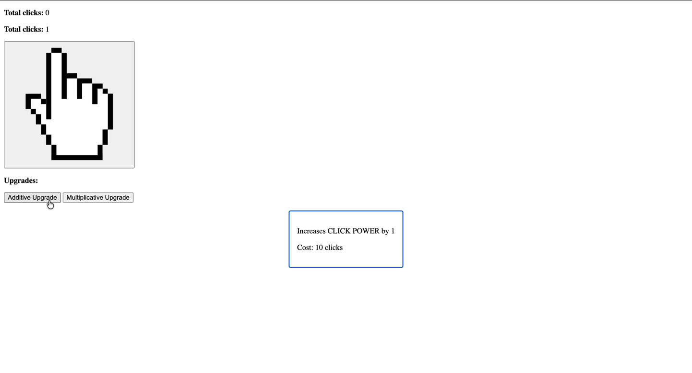
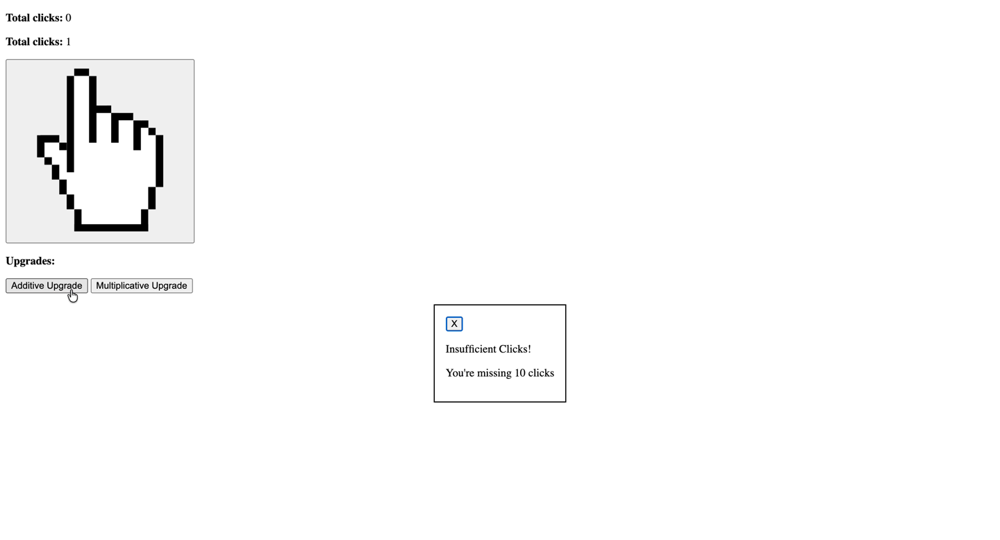
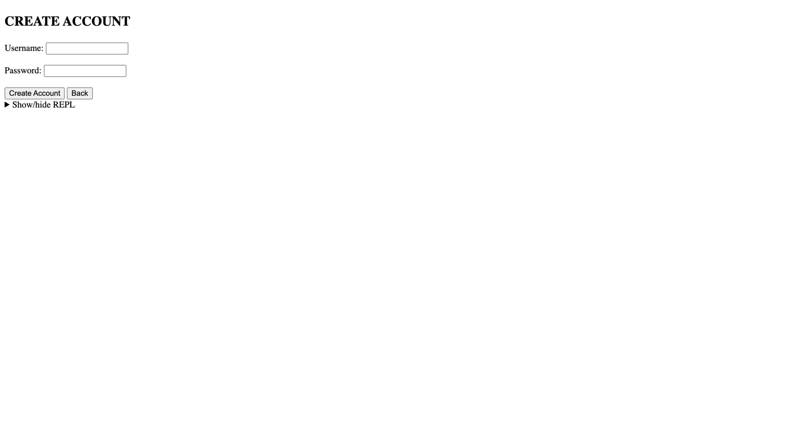
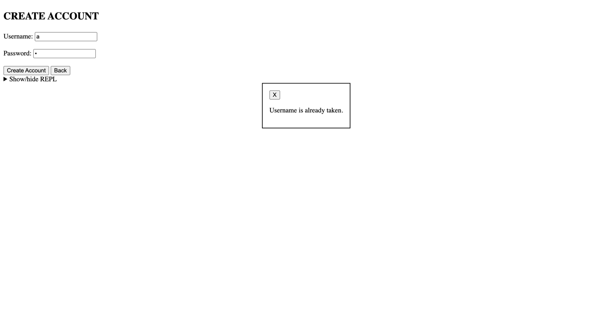
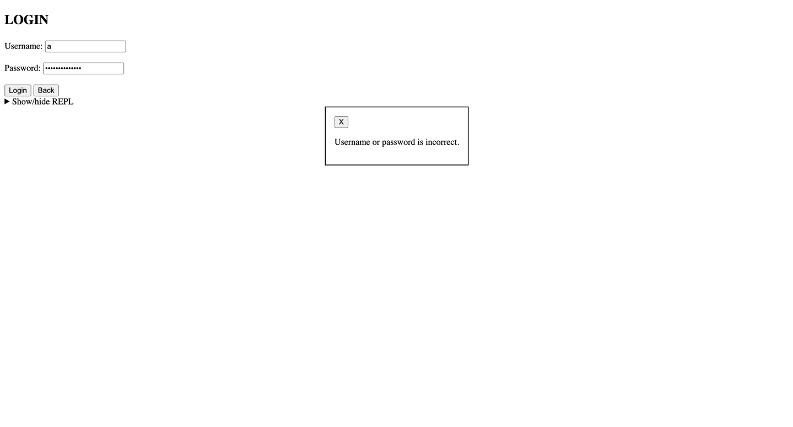
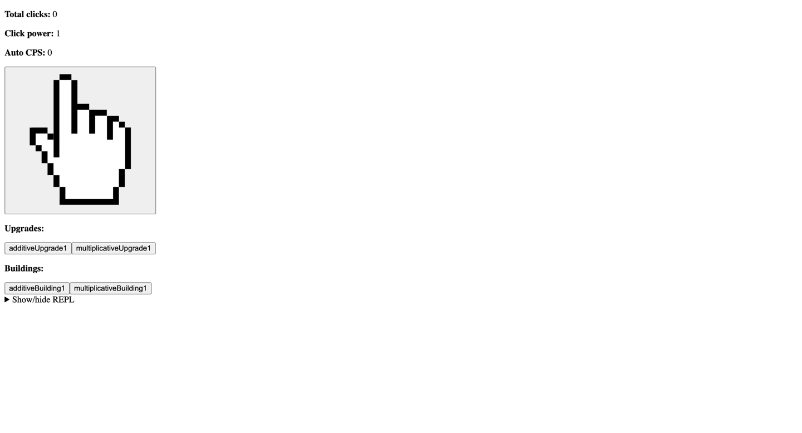
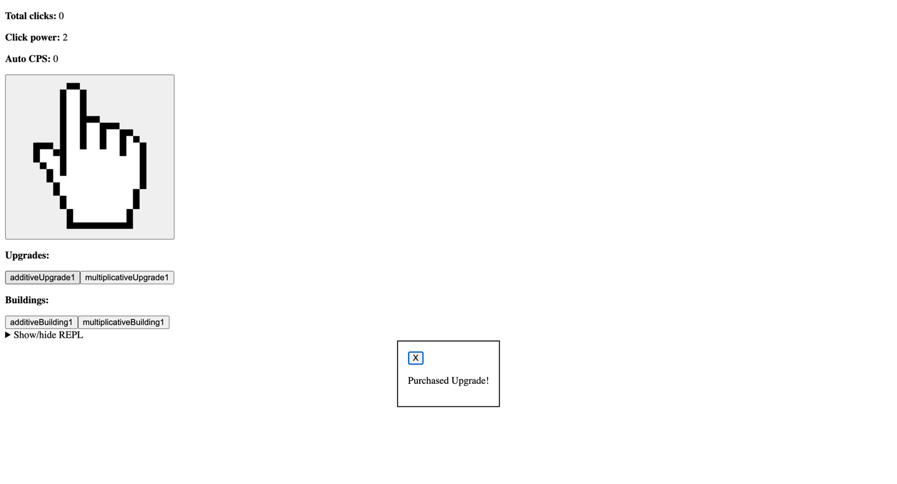

# Phase 1

Here's my entire UI for phase 1:

## Phase 1 Visibility
My initial implementation of this UI was moderately visible because:
* **Are possible actions visible in context?** 
Yes, the primary interaction (the cursor icon) and the upgrade buttons are always present on the main screen.
* **Are actions visible but "disabled"?** 
No; the buttons remain visually active even when the user cannot afford them,
requiring a click to discover the "Insufficient Clicks" state.
* **Does the user know the system state?** 
Yes, the "Total clicks" counter at the top left provides a constant
indicator of the user's current progress and "currency."

## Phase 1 Feedback
My initial implementation of this UI had adequate feedback:
* **Does the system inform the user it is processing?**
Yes, there is visible output from the click of every button, indicating whether the state has changed (increased 
total clicks, increased click power, etc).
* **Does the system inform the user of correct input?** 
Yes, the hover-state description tells the user exactly what is required (e.g., "Cost: 10 clicks").
* **Does it inform the user of results?**
Yes, the UI provides clear success ("Purchased Upgrade!") and failure ("Insufficient Clicks!") popups.
* **Is the action clearly communicated for results?** 
Yes, the error message specifically states what is missing ("You're missing 10 clicks"), making it actionable. However, 
the program never indicates to the user that the way to increase clicks is by clicking on the cursor.

## Phase 1 Consistency
My initial implementation of this UI looked terrible, but had good consistency:
* **Do all buttons consistently use labels?** 
The "Additive Upgrade" and "Multiplicative Upgrade" buttons use clear, consistent terminology for their functions.
However, they are not verbs, and the cursor button has no labels at all to indicate its use or function.
* **Do all input fields have labels?** 
No; while the upgrade buttons descriptions are explicitly labeled, the cursor button which increments total clicks
is not, which may lead to confusion and inconsistency 
* **Do all similar operations flow in same way?**
Yes, both upgrade buttons trigger a similar popup for description, insufficient funds, and confirmation of purchase.

# Phase 2

Here are the major new parts of my interface for phase 2:

Here's the main UI as I submitted it for phase 2:

## Changes from phase 1

* The main change I made from phase 1 to phase 2 was to add a login menu to my game, buildings that autoclick 
every second, and individual accounts. A new metric "AutoCPS" shows the autoclick power.

## Phase 2 visibility
My Phase 2 implementation of visibility has improved in data display but regressed in button clarity:
* **Are possible actions visible in context?**
Yes, the "Buildings" section is clearly labeled and separated from "Upgrades,"
making it easy to see there are two types of purchases available.
* **Are actions visible but "disabled"?**
Similar to Phase 1, the buttons (e.g., "additiveUpgrade1") remain clickable even if the user cannot afford them,
requiring a click to find out the cost.
* **Does the user know the system state?**
Yes, the inclusion of metrics (Click Power, AutoCPS) gives the user insights into their current state, and the 
layout is distinct from the login state. One thing missing is the indication of which user is currently logged in,
which may confuse some users.
* The button labels have become less visible in terms of meaning. Changing "Additive Upgrade" to "additiveUpgrade1"
makes it look like a variable name rather than a user-facing button. A user might not know what the "1" signifies.

## Phase 2 feedback
My Phase 2 implementation of feedback is good:
* **Does the system inform the user it is processing?**
The error and success dialog is still present from Phase 1, which gives clear indication of something happening within
the program to users.
* **Does the system inform the user of correct input?**
The Login and Create Account screens have clear labels ("Username:", "Password:"), and the input validation
for accounts has been added, which indicates to users if their username is already take, if the credentials match, etc.
*   **Does it inform the user of results?**
The game screen updates the stats immediately, and instantly changes total clicks/click power/autoCPS automatically.

## Phase 2 consistency
My Phase 2 UI has some consistency issues, particularly with naming conventions and styling:
* **Do all buttons consistently use labels?**
No. The upgrade buttons have removed spaces and use camelCase, while the account menu uses Title Casing, and some buttons
have verbs ("Login, Create Account"), while others have nouns ("AdditiveUpgrade1").
* **Do all input fields have labels?**
Yes, the "Username" and "Password" fields on the login/create screens are consistently labeled and styled.
* **Do all similar operations flow in same way?**
Yes, the "Back" button is present on both the Login and Create Account screens, providing a consistent way
to return to the Welcome screen. All upgrades and buildings operate in the same way (Hover for description, insufficient
funds validation, success dialog).

## How I might change my UI for Phase 3
* **Make Unaffordable Actions Visibly Disabled:** I will grey out or indicate in some other way (dialog indication)
to users that certain upgrades/buildings cannot currently be purchased
* **Fix Button Labels:** I will change "additiveUpgrade1" back to human-readable text like 
"Upgrade Click Power (Lvl 1)" or simply "Click Power Upgrade."
* **Visual Feedback for Account User:** I will indicate to users the name of the user at the 
top for better state awareness
* **Clearly Show Core Mechanic:**: I will indicate to users that clicking on the cursor will increase total clicks